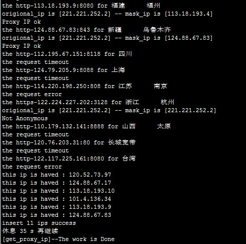
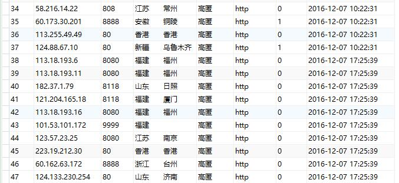

### Using Python to build a high-level ip proxy pool

#### 用Python搭建高匿代理池

* Python
* xslt
* sqlite3
* lxml
* selenium + phantomjs

***

#### Supported Proxy Site

* [代理ip_免费ip代理服务器地址_http代理软件_免费ip代理_秘密代理IP](http://www.mimiip.com/)
* [快代理 - 高速http代理ip每天更新](http://www.kuaidaili.com)
* [高匿代理IP_免费ip代理_IP巴士](http://ip84.com/gn)
* [免费代理IP_HTTP代理服务器IP_隐藏IP_QQ代理_国内外代理_西刺免费代理IP](http://www.xicidaili.com)

#### xslt Template

model Name `proxyshow`

* `xip`        ip地址
* `xport`      端口号
* `xaddr`      区域地址
* `xlevel`     匿名度
* `xprotocal`  类型 http https

#### Test

The simple demo to see `test_run_old.py` for more details.

```
	# 获取代理ip for mimiip
	def get_proxy_ip_mimiip(self,urlFormat,tmpName,maxPageNo=1,urlType=1):
		"""[获取代理ip for mimiip]
		
		[注意：该方法为示例方法，用于演示抓取站点代理IP列表及验证到保存入库的完整过程]

		Arguments:
			urlFormat {[type]} -- [链接]
			tmpName {[type]} -- [模板目录]
		
		Keyword Arguments:
			maxPageNo {number} -- [最大页码] (default: {1})
			urlType {number} -- [1:静态页  2:动态页] (default: {1})
		"""
		
		extra=Extractor()
		extra.setXsltFromFile(tmpName)
		doSpider=Spider()
		p=SqliteHelper()

		if maxPageNo <= 1:
			maxPageNo=1
		maxPageNo+=1

		for page in range(1,maxPageNo):
			url=urlFormat.format(page)
			# url='http://www.mimiip.com/gngao/{0}'.format(page)

			html_dom=doSpider.getContent(url,urlType)
			op_xml=extra.extractHtmlDomtoXml(html_dom)
			op_json=doSpider.xmlToJson(op_xml)

			# proxyman.info(op_json)
			# print(op_json)
			# return False
			# break

			# 解析转换后的json
			obj=json.loads(op_json)
			proxy_list=[]
			if obj['proxyshow']:
				for ps in obj['proxyshow']['item']:
					proxy_dict={}

					proxy_dict['xip']=ps['xip']
					proxy_dict['xport']=ps['xport']
					proxy_dict['xaddr']=ps['xaddr'].replace('\n','')
					proxy_dict['xlevel']=ps['xlevel']
					proxy_dict['xprotocal']=ps['xprotocal'].lower()
					proxy_list.append(proxy_dict)

			proxy_list_ok=[]
			# 遍历，验证代理ip是否可用
			for pro in proxy_list:
				aa_show='the {0}-{1}:{2} for {3}'.format(pro['xprotocal'],pro['xip'],pro['xport'],pro['xaddr'].encode('utf-8'))
				print(aa_show)
				proxyman.info(aa_show)

				p_ip={"{0}".format(pro['xprotocal']):"http://{0}:{1}".format(pro['xip'],pro['xport'])}
				res=self.check_proxy_ip(p_ip)
				if res:
					proxy_list_ok.append(pro)

			# 将筛选处理后的代理IP添加到数据库中
			count = p.db_insert_for_proxyip(proxy_list_ok)
			print('insert %d ips success' %(count))

			# 获取完一页数据后，休息一下
			shelper.makeSleep(5)
```

***

#### Error Log

##### `{"dailishow": null}`

返回的错误信息如下：

```
{"dailishow": null}
[proxy_kuaidaili]--error-'proxyshow'
```

该错误是 xslt在解析html源代码时，未解析到相应数据导致的。

可能的一种情况是：如 []() 页面，通过查看网页的源代码发现页面数据时静态的，然而我们直接通过该静态页面得到的xslt模板文件却在程序中调用时无法获取到内容。

可以通过方法 `get_proxy_ip()` 在获取网页html内容时，将html源代码通过方法 `page_htmlStr=doSpider.htmlStr` 保存到日志中，然后再对获取到的html源代码进行处理后得到xslt模板文件，通过该模板文件就能获取到想要的数据了。

另外一种简单的方法是直接作为 `动态` 网页数据通过 `phantomjs` 来处理，设置 `urlType=2` 即可。

***

##### `{"dailishow": null}`

还有一种情况下 xslt模板无法解析到数据。

当网页中的列表是由 `<table>` 来展示的情况下，标签 `<tbody>` 可能会造成生成的 xpath规则错误。一般情况下，在Chrome的F12下，能看到 `<table>` 一般都是带有 `<tbody>` 的，而查看网页源代码的时候，静态页面中并没有 `<tbody>` 标签。

这种情况下可以通过对抓取到的html源代码来进行解析生成 xslt模板文件。

***

#### Demo

执行过程： 



数据库：



